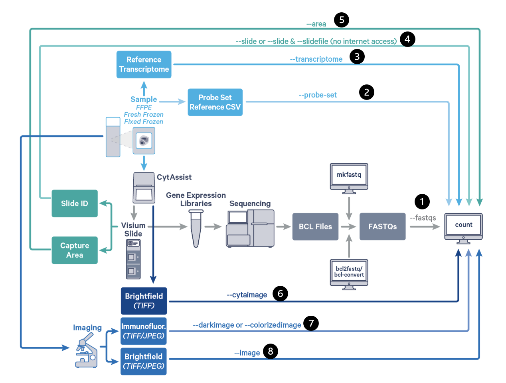

# Spatial transcriptomics/10x visium data preparation
This repository aims to detail the processing of space ranger pipeline from FATSTQ files to gene expression matrix.

## Spaceranger
[10x website](https://www.10xgenomics.com/support/software/space-ranger/downloads) has everything you need.
### T6 - Download spaceranger
`curl -o spaceranger-3.1.0.tar.gz "https://cf.10xgenomics.com/releases/spatial-exp/spaceranger-3.1.0.tar.gz?Expires=1725896757&Key-Pair-Id=APKAI7S6A5RYOXBWRPDA&Signature=WK99c6k20ugLmLa3~kMwPiUjEdiUe5IYmH4~~fK8CGazp4jPcFrCDaJSyCkrDyOE8lVf~mWUOLFOgoHEJdAca9O1lsRgjRR7wUWJL6olTM5zIuaA-bx0XI325baKaWZZraBE-r7trCltMzWwSuW4Cqtw1qp2GeMe2Gm40dUgFCVhwpRJFnc9i-ajM~s5ScJrl8mT4GFlJ4a56q2tmer0UxzmmatkdOMzRJdsCEH~CMGz0dfXdX0OEFbcOorAq3RPsmo4~nQOzwKRaG4LCCN8MeM9BAplrmImBJ0L0PedbkA3NixOv900YnxgBz8zscfKIe0meqWlxnOaKBUTE9igoQ__""`

### T6 - Install spaceranger
- Unpack, `tar -xzvf spaceranger-3.1.0.tar.gz`

- Prepend the Space Ranger directory to your $PATH. This allows you to invoke the spaceranger command.
`$ export PATH=/home/xpan7/spaceranger-3.1.0:$PATH`

or add it to `.bashrc` where you can find `nano ~/.bashrc`
After editing, save the changes and exit the editor by pressing Ctrl + X, then Y, and finally Enter.

- To apply the changes made in .bash_profile without restarting the terminal, you can run:
`source ~/.bashrc`

- To test if spaceranger is installed successfully

navigate to your own dir, `/rsrch5/home/trans_mol_path/xpan7/project`, to ensure the output of testing sample is stored in your own dir instead of yuanlab dir.

then `spaceranger testrun --id=tiny`

### Seadragon - spacerager
There is spaceranger module installed in Seadragon, please refer to `sample_specific_spaceranger_hpc.lsf` to run spaceranger in Seadragon.

Note that,

- You'll see the following after `module load spaceranger`, but it doesn't mean the spaceranger version is 1.1.0; it's actually 3.0.1 if using `spaceranger --version` to check
`Reference data are located in path
                /rsrch3/scratch/reflib/REFLIB_data/spaceranger-1.1.0`

- The error logs can be found in .out files. If you cannot find the error info in .err files, also check with .out files.

## Data to spaceranger
This is the flowchart for running spaceranger count for FFPE, adapted from [10x](https://www.10xgenomics.com/support/software/space-ranger/latest/analysis/running-pipelines/probe-based-assay-count-cytassist-gex) 

1. Sequencing data, FASTQ files, from your collaborators or core facility.

### Tips for high-res H&E and alignment
1. Ensure the high-res H&E image from your collaborator cover the ST area, can be biger that ST area, but cannot be smaller!!!

2. Ensure the format of high-res H&E image is among .jpeg, .jpg, .png, .tiff relevant (.tif, .btf), qptiff, not .svs, .ndpi, .czi etc, whihc spaceranger and loupe browser are not compitable with. If the only available image is .svs, we can use Aperio software to crop and save as tiff.

3. Ensure the aligmnet was conducted by the same person to mitigate batch effects.

4. As per 10x, if the CytAssist image has partial fiducial frame obstruction by the tissue section or one or more edges were cropped, then it warrants continuing with the manual fiducial alignment workflow. Some subset of issues with the tissue staining (weak staining, incomplete staining, or excessive staining with leakage outside of the tissue section) can also interfere with the accurate identification of the tissue-associated spots using the automated image processing pipeline. In these cases, it is recommended to complete the manual fiducial alignment workflow.

## Potential issues and relevant solutions
1. What if collaborators somehow swapped the positions of the visium slide during library preparation, e.g., it was supposed to be ID1 for A, and ID2 for B, however, they made A as ID2, and B as ID1.

⋅⋅⋅Solution:

2. error: invalid value '/rsrch6/home/trans_mol_path/yuan_lab/TIER2/anthracosis/visium_TMA5primary2014/spatial-transcriptome/TMA5-161' for '--id <ID>'

⋅⋅⋅Solution:

3. error: the argument '--loupe-alignment <PATH>' cannot be used with '--override-id'

⋅⋅⋅Solution:

4. ERROR: You specified --slide V53B02-066 --area B, but during manual image alignment in Loupe you specified slide ID is not known.

⋅⋅⋅Solution:

5. ERROR: You specified --slide V53B02-382 --area A, but during manual image alignment in Loupe you specified slide ID V53B02-382 and capture area A1.

⋅⋅⋅Solution: