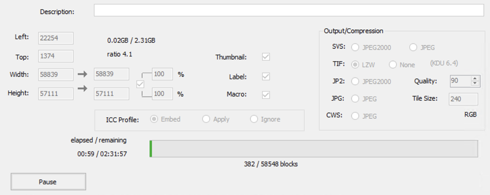

# Spatial transcriptomics/10x visium data preparation
This repository aims to detail the processing of space ranger pipeline to convert FATSTQ files to gene expression matrix.

## Spaceranger
[10x website](https://www.10xgenomics.com/support/software/space-ranger/downloads) has everything you need.
### T6 - Download spaceranger
```
curl -o spaceranger-3.1.0.tar.gz "https://cf.10xgenomics.com/releases/spatial-exp/spaceranger-3.1.0.tar.gz?Expires=1725896757&Key-Pair-Id=APKAI7S6A5RYOXBWRPDA&Signature=WK99c6k20ugLmLa3~kMwPiUjEdiUe5IYmH4~~fK8CGazp4jPcFrCDaJSyCkrDyOE8lVf~mWUOLFOgoHEJdAca9O1lsRgjRR7wUWJL6olTM5zIuaA-bx0XI325baKaWZZraBE-r7trCltMzWwSuW4Cqtw1qp2GeMe2Gm40dUgFCVhwpRJFnc9i-ajM~s5ScJrl8mT4GFlJ4a56q2tmer0UxzmmatkdOMzRJdsCEH~CMGz0dfXdX0OEFbcOorAq3RPsmo4~nQOzwKRaG4LCCN8MeM9BAplrmImBJ0L0PedbkA3NixOv900YnxgBz8zscfKIe0meqWlxnOaKBUTE9igoQ__""
```

### T6 - Install spaceranger
- Unpack, `tar -xzvf spaceranger-3.1.0.tar.gz`

- Prepend the Space Ranger directory to your `$PATH`, `$ export PATH=/home/xpan7/spaceranger-3.1.0:$PATH`, this allows you to invoke the spaceranger command.
  
- Or add it to `.bashrc` where you can find `nano ~/.bashrc`. After editing, save the changes and exit the editor by pressing Ctrl + X, then Y, and finally Enter. To apply the changes made in .bash_profile without restarting the terminal, you can run `source ~/.bashrc` in terminal

- To test if spaceranger is installed successfully,
   - navigate to your own dir, `/rsrch5/home/trans_mol_path/xpan7/project`, to ensure the output of testing sample is stored in your own dir instead of yuanlab dir.
   - then `spaceranger testrun --id=tiny`    


### Seadragon - spacerager
There is spaceranger module installed in Seadragon, please refer to `sample_specific_spaceranger_hpc.lsf` to run spaceranger in Seadragon.

Note that,

- You'll see the following after `module load spaceranger`, but it doesn't mean the spaceranger version is 1.1.0; it's actually 3.0.1 if using `spaceranger --version` to check with.
   
   `Reference data are located in path /rsrch3/scratch/reflib/REFLIB_data/spaceranger-1.1.0`

- The error logs can be found in .out files. If you cannot find the error info in .err files, also check with .out files.


## Data to spaceranger
This is the flowchart for running spaceranger count for FFPE, adapted from [10x](https://www.10xgenomics.com/support/software/space-ranger/latest/analysis/running-pipelines/probe-based-assay-count-cytassist-gex) 


### Basic inputs for automatic alignment
1. `--fastqs`: sequencing data, FASTQ files, from your collaborators or core facility.
2. `--prob-set`: the probe set reference CSV file, downloaded from [10x](https://www.10xgenomics.com/support/software/space-ranger/downloads) if no customed targets, `Human reference (GRCh38)`.
3. `--transcriptome`: the reference transcriptome for the species, downloaded from [10x](https://www.10xgenomics.com/support/software/space-ranger/downloads) if no customed targets, `Probe Set CSV V2`.
4. `--slide`: visium slide serial number, for example 'V10J25-015'. Strongly recommended for Visium HD. If unknown, use --unknown-slide instead
5. `--area`: visium capture area identifier, for example 'A1' (or, e.g. 'A' for 11 mm capture area slides). Must be used along with --slide unless --unknown-slide is used
6. `--cytaimage`: image captured by CytAssist instrument (contains fiducial frame), H&E-stained, small size
7. `--darkimage`: dark background fluorescence microscope image
8. `--image`: brightfield microscope image, i.e., high-res H&E image

### Additional inpus for manual alignment
`--loupe-alignment`:


### Tips for high-res H&E and alignment
1. Ensure the high-res H&E image from your collaborator cover the ST area, can be biger that ST area, but cannot be smaller!!!
2. Ensure the format of high-res H&E image is among .jpeg, .jpg, .png, .tiff relevant (.tif, .btf), qptiff, not .svs, .ndpi, .czi etc, which spaceranger and loupe browser are not compitable with. If the only available image is .svs, we can use Aperio ImageScope software to crop and save as tiff.
   - Lanch Aperio ImageScope in T3
   - Click Image -> Rotate image to align .svs and CytAssist image regarding the direction
   - Click extract region, then select the area relevant to CytAssist image to crop
   - Save it as TIF, with LZW compression, otherwise it'll be very large. You can also tweak the Quality (90 and above are recommended) and Tile Size (240 or 256 are recommended) settings
   
   - Alternatively, you can use `vips` command to convert .svs to .tif image, 
   ```
   vips copy TMA5-157-svs.svs TMA5-157-svs.tif[pyramid,tile,compression=jp2k,Q=100,tile-width=240,tile-height=240]
   ```
   There is no `vips`` module installed in seadragon, you need to insall [vips](https://formulae.brew.sh/formula/vips) in your local machine. Bio-Formats should also work, please refer to [bfconvert](https://bio-formats.readthedocs.io/en/latest/users/comlinetools/conversion.html).
3. Ensure the aligmnet was conducted by the same person to mitigate batch effects.
4. As per 10x, if the CytAssist image has partial fiducial frame obstruction by the tissue section or one or more edges were cropped, then it warrants continuing with the manual fiducial alignment workflow. Some subset of issues with the tissue staining (weak staining, incomplete staining, or excessive staining with leakage outside of the tissue section) can also interfere with the accurate identification of the tissue-associated spots using the automated image processing pipeline. In these cases, it is recommended to complete the manual fiducial alignment workflow.
5. Ensure the H&E images you are processing are exactly the same with the H&Es used in spaceranger.


## Potential issues and relevant solutions
1. What if collaborators somehow swapped the IDs of the areas on the visium slide during library preparation, e.g., it was supposed to be ID1 for A, and ID2 for B, however, they named ID1 on A as ID2, and named B as ID1.
   **Solution:** 
      - Firstly, check with your collaborators if they managed to re name the CytAssist run info, or the CytAssist image (with         fiducial). If no, you need to re name the  CytAssist images correctly.
      - Secondly, in the `spaceranger count` command, input corrected files and flag `--override-id` if you use the automatic alignment, i.e., no input for `--loupe-alignment`.

2. error: invalid value '/rsrch6/home/trans_mol_path/yuan_lab/TIER2/anthracosis/visium_xxxxxx/spatial-transcriptome/ID-161' for '--id <ID>'
   
   **Solution:** The srting for `--id` is too long, it's required 64 characters or less. You can navigate to the destination dir to run spaceranger.

3. error: the argument '--loupe-alignment <PATH>' cannot be used with '--override-id'

   Solution:

4. ERROR: You specified --slide V53B02-066 --area B, but during manual image alignment in Loupe you specified slide ID is not known.

   Solution:

5. ERROR: You specified --slide V53B02-382 --area A, but during manual image alignment in Loupe you specified slide ID V53B02-382 and capture area A1.

   Solution: